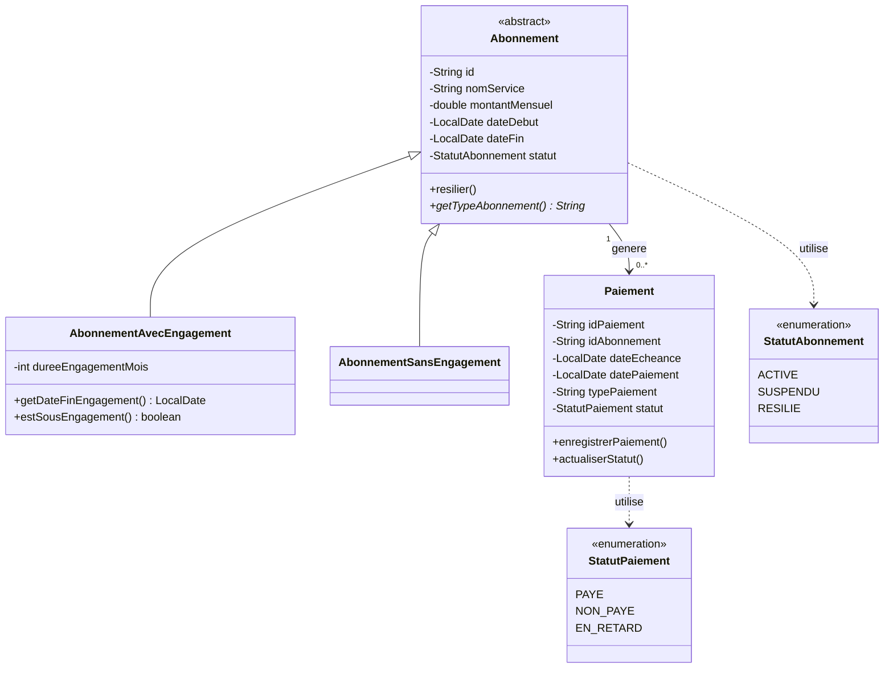

# Diagramme de classes — Gestion des Abonnements

```mermaid
classDiagram
  class Abonnement {
    <<abstract>>
    -String id
    -String nomService
    -double montantMensuel
    -LocalDate dateDebut
    -LocalDate dateFin
    -StatutAbonnement statut
    +resilier()
    +getTypeAbonnement()* String
  }
  class AbonnementAvecEngagement {
    -int dureeEngagementMois
    +getDateFinEngagement() LocalDate
    +estSousEngagement() boolean
  }
  class AbonnementSansEngagement
  class Paiement {
    -String idPaiement
    -String idAbonnement
    -LocalDate dateEcheance
    -LocalDate datePaiement
    -String typePaiement
    -StatutPaiement statut
    +enregistrerPaiement()
    +actualiserStatut()
  }
  class StatutAbonnement {
    <<enumeration>>
    ACTIVE
    SUSPENDU
    RESILIE
  }
  class StatutPaiement {
    <<enumeration>>
    PAYE
    NON_PAYE
    EN_RETARD
  }
  Abonnement <|-- AbonnementAvecEngagement
  Abonnement <|-- AbonnementSansEngagement
  Abonnement "1" --> "0..*" Paiement : genere
  Abonnement ..> StatutAbonnement : utilise
  Paiement ..> StatutPaiement : utilise
```